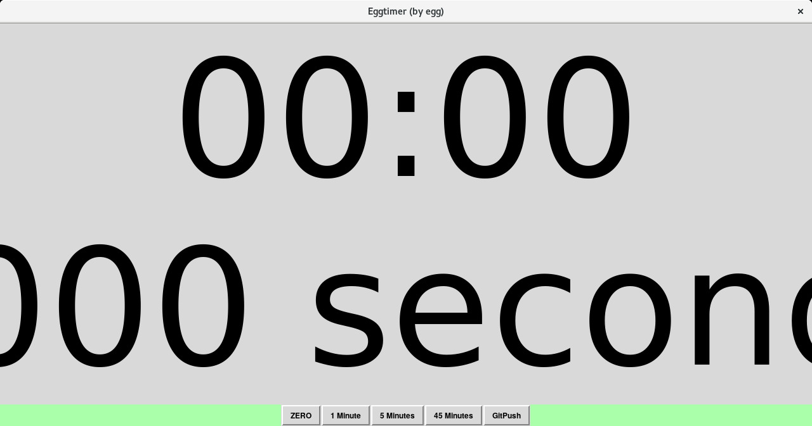

##Old Perl/TK based Egg-Timer, easy to configure, runs scripts on timesup.

Giant font is acceptable for hassling presenters.

Run:
```perl
 $perl eggtimer.pl
```


FILES:

    1.eggtimer
    2.eggtimer.pl
    3.gitpush.sh
    4.README.md
    5.timesup.png
    6.timesup.sh
    7.date_time
        1.date_time.pl
        2.README.md
